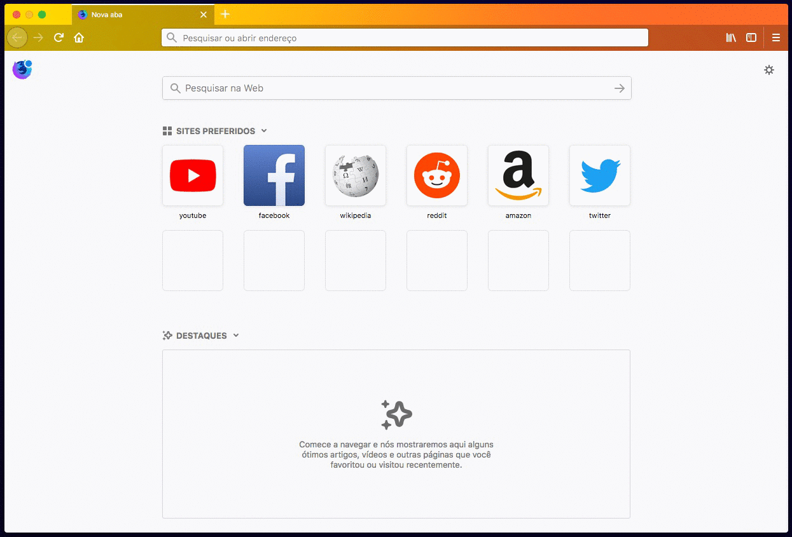

# Gradientus

Gradientus is a dynamic theme available as a [webextension](https://developer.mozilla.org/en-US/Add-ons/WebExtensions) for Firefox Quantum that changes colors automatically based on time of day.

Gradientus is inspired by [Quantum Lights](https://addons.mozilla.org/en-US/firefox/addon/quantum-lights-dynamic/) of [Sean Martel](https://twitter.com/mart3ll).

### Colors

Morning: `#f9d423` to `#d97946`

Afternoon: `#d97946` to `#6018dc`

Night: `#6018dc` to `#43cbff`

Dawn: `#43cbff` to `#f9d423`

Private Browsing: `#221f47` to `#560083`

## Requirements

* Firefox 57.0 or later

## How to Install

Install this extension through [addons.mozilla.org](https://addons.mozilla.org/en-US/firefox/addon/gradientus/).

## How to Testing

It's easy to try out this webextension:

1. Clone this repository `git clone https://github.com/cynthiapereira/webextension-gradientus.git`

1. Open Firefox and load `about:debugging` in the URL bar.

1. Click the [Load Temporary Add-on](https://developer.mozilla.org/en-US/Add-ons/WebExtensions/Temporary_Installation_in_Firefox) button and select the `src/manifest.json` file within the directory of this repository.

1. You should now see the Gradientus dynamic theme applied in the browser.

## How to Contribute

Contributions are always welcome! Before you submit an issue or pull request, please read the [contribution guidelines](https://github.com/cynthiapereira/webextension-gradientus/blob/master/CONTRIBUTING.md).

## License

The source code is licensed under the [MPL 2.0](https://github.com/cynthiapereira/webextension-gradientus/blob/master/LICENSE) license.
